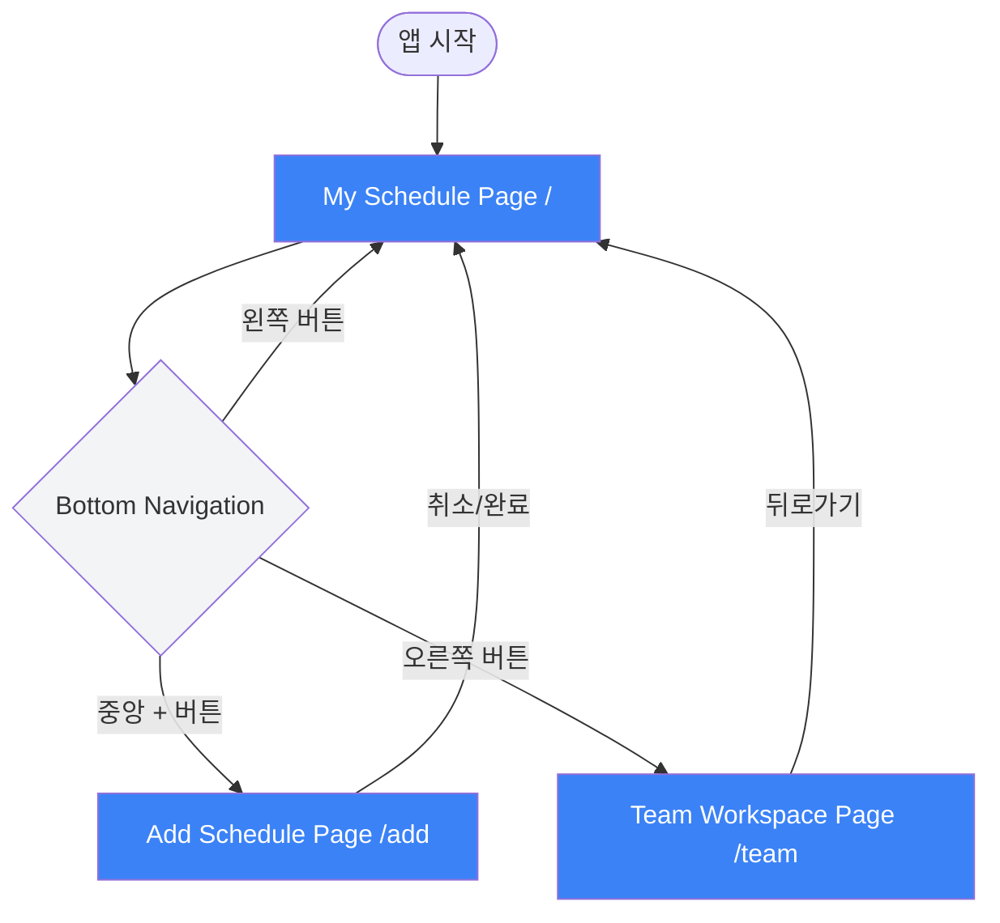
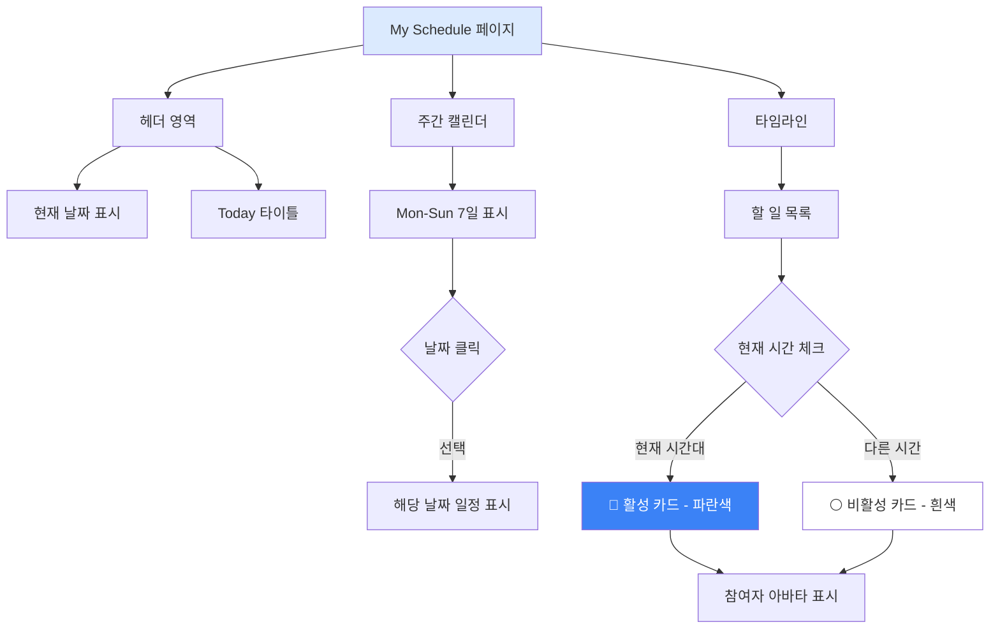
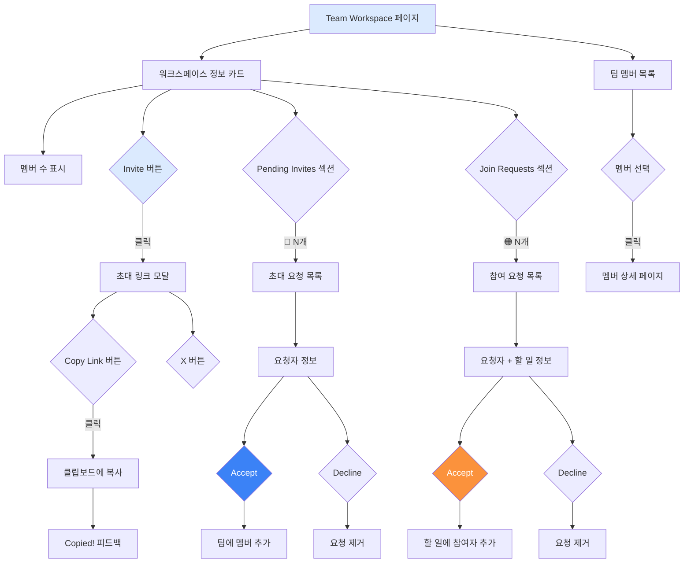
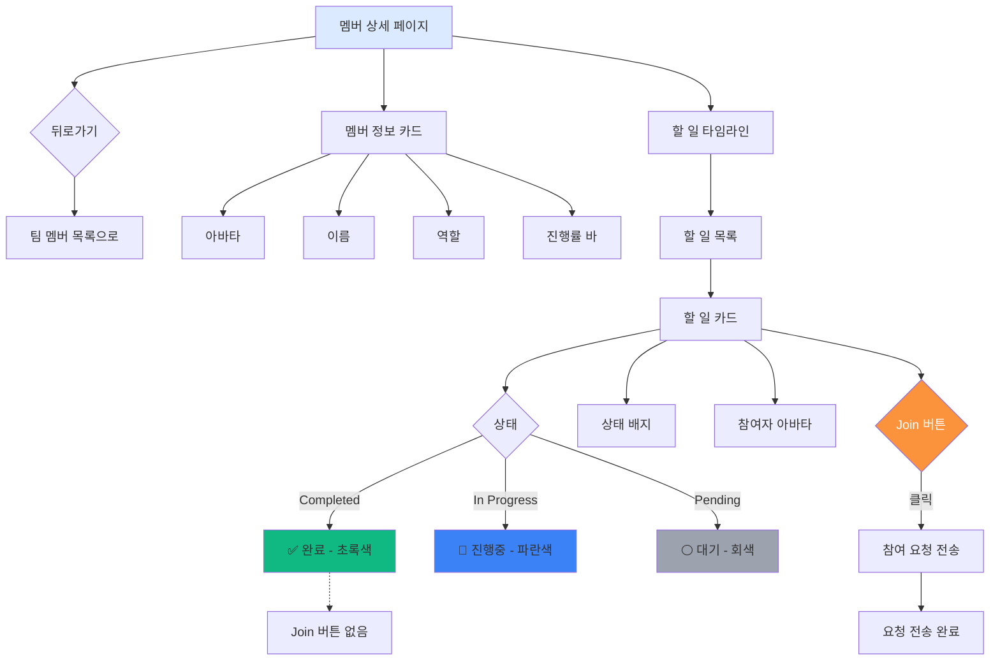
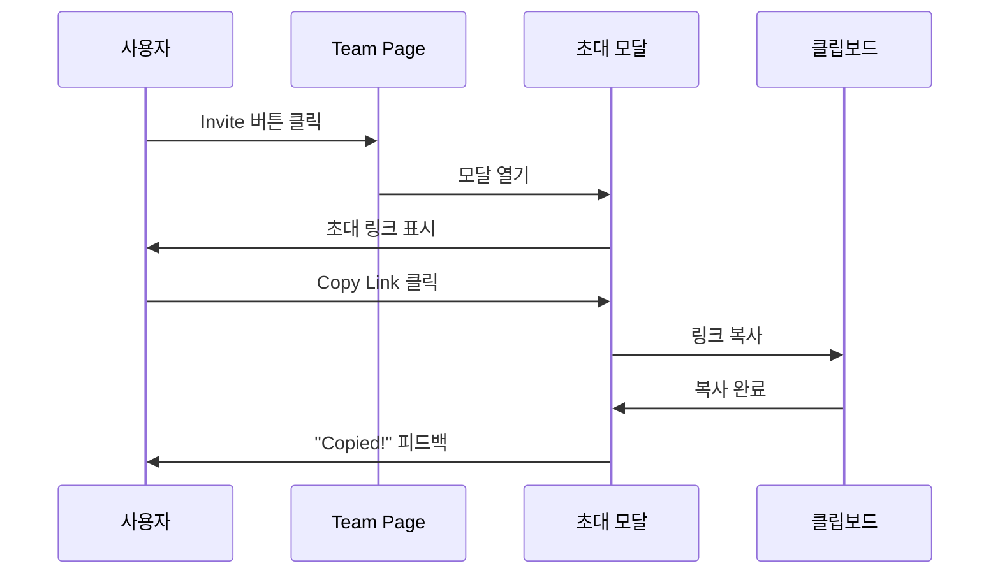
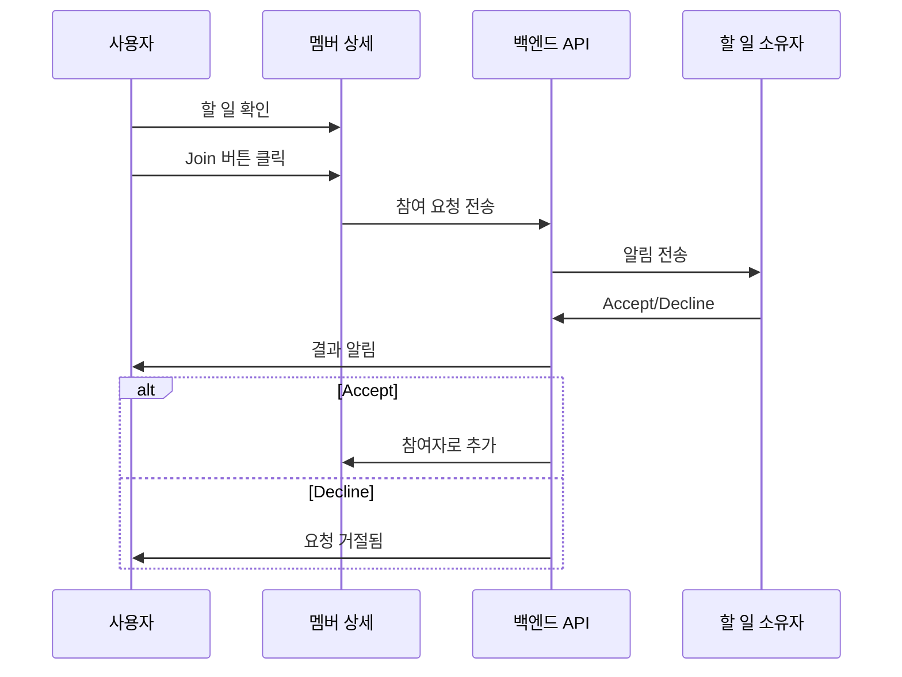
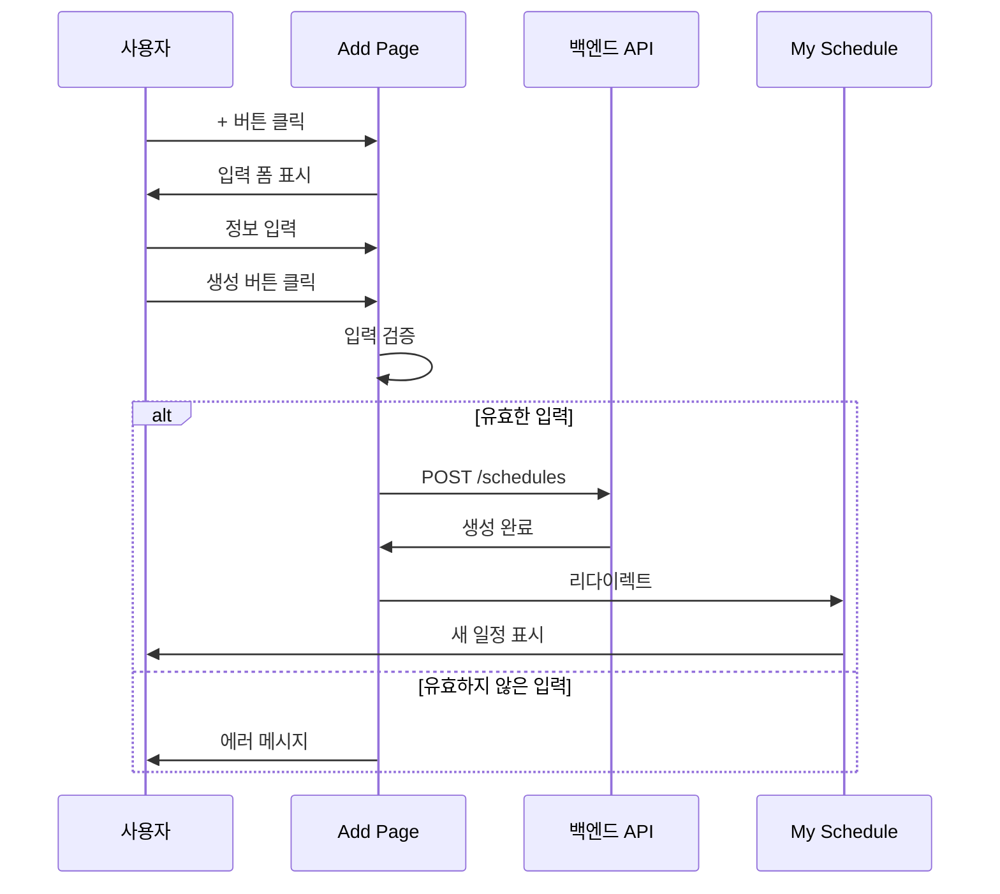
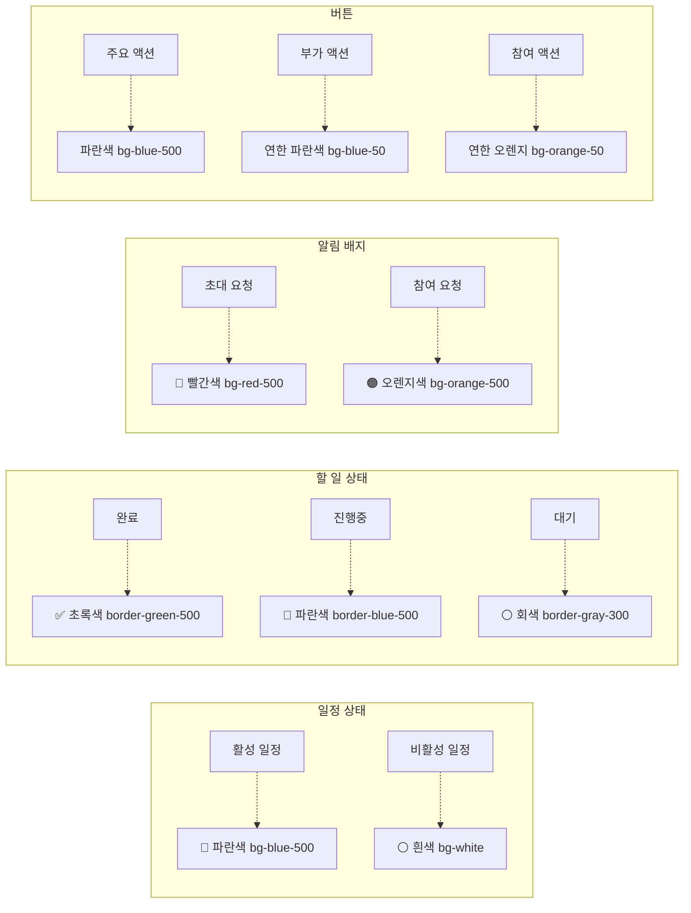
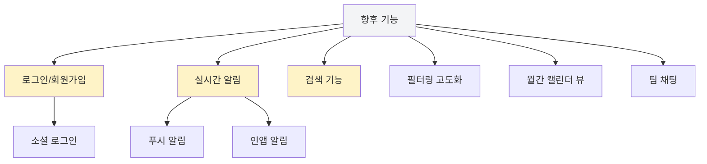

# Shared Todo Lite - User Flow

## 📱 전체 앱 구조



---

## 🗓️ My Schedule 페이지 상세



---

## ➕ Add Schedule 페이지 상세

```mermaid
graph TB
    AddPage[Add Schedule 페이지] --> BackBtn[뒤로가기 버튼]
    AddPage --> Form[일정 입력 폼]
    AddPage --> Actions[액션 버튼]
    
    Form --> TitleInput[제목 입력*]
    Form --> TimeInput[시간 선택*]
    Form --> DescInput[설명 입력]
    Form --> ParticipantInput[참여자 추가+]
    
    Actions --> Cancel{취소}
    Actions --> Submit{생성}
    
    Cancel --> Home[/ 페이지로 이동]
    Submit --> Validate{입력 검증}
    Validate --> |성공| SaveAPI[API 호출 - 일정 저장]
    Validate --> |실패| ShowError[에러 메시지]
    SaveAPI --> Home
    
    BackBtn --> Home
    
    style AddPage fill:#dbeafe
    style Submit fill:#3b82f6,color:#fff
    style Cancel fill:#f3f4f6
```

---

## 👥 Team Workspace 페이지 상세



---

## 📋 멤버 상세 페이지 (Team Workspace 내)



---

## 🔄 주요 인터랙션 플로우

### 1. 워크스페이스 초대하기


### 2. 할 일 참여하기


### 3. 일정 추가하기


---

## 📊 페이지별 주요 기능 요약

| 페이지 | 경로 | 주요 기능 |
|--------|------|-----------|
| **My Schedule** | `/` | • 주간 캘린더로 날짜 선택<br>• 선택된 날짜의 일정 타임라인<br>• 현재 시간 기반 활성 일정 강조<br>• 참여자 표시 |
| **Add Schedule** | `/add` | • 일정 제목 입력 (필수)<br>• 시간 선택 (필수)<br>• 설명 입력<br>• 참여자 추가<br>• 취소/생성 |
| **Team Workspace** | `/team` | • 팀 멤버 수 표시<br>• 초대 링크 복사<br>• 워크스페이스 초대 수락/거절<br>• 할 일 참여 요청 수락/거절<br>• 멤버별 할 일 확인 |
| **Member Detail** | `/team` 내 | • 멤버 정보 및 진행률<br>• 할 일 목록 (상태별)<br>• Join 버튼으로 참여 요청<br>• 참여자 표시 |

---

## 🎨 UI 상태별 색상 가이드



---

## 🚀 향후 확장 가능한 플로우



---

## 📝 사용 방법

### VSCode에서 보기
1. 이 파일을 VSCode에서 열기
2. `Cmd+Shift+V` (Mac) 또는 `Ctrl+Shift+V` (Windows) - Markdown 미리보기
3. Mermaid 다이어그램이 자동으로 렌더링됩니다

### GitHub에서 보기
1. 이 파일을 GitHub에 푸시
2. GitHub에서 자동으로 Mermaid 다이어그램 렌더링

### 온라인 도구
- [Mermaid Live Editor](https://mermaid.live/) - 실시간 편집 및 내보내기
- [Draw.io](https://app.diagrams.net/) - 수동으로 그리기
- [Excalidraw](https://excalidraw.com/) - 손그림 스타일 다이어그램

---

## 📌 주요 사용자 시나리오

### 시나리오 1: 개인 일정 관리
1. 앱 열기 → My Schedule 페이지
2. 주간 캘린더에서 원하는 날짜 클릭
3. 해당 날짜의 일정 확인
4. 현재 시간대 일정이 파란색으로 강조됨

### 시나리오 2: 새 일정 추가
1. 하단 네비게이션의 '+' 버튼 클릭
2. 제목, 시간, 설명 입력
3. 필요시 참여자 추가
4. '생성' 버튼으로 저장
5. My Schedule로 돌아가 일정 확인

### 시나리오 3: 팀 협업
1. 하단 네비게이션의 사용자 아이콘 클릭
2. Team Workspace에서 팀 멤버 확인
3. 멤버 선택하여 할 일 확인
4. 참여하고 싶은 할 일의 'Join' 버튼 클릭
5. 멤버가 요청 수락 시 참여자로 추가됨

### 시나리오 4: 팀원 초대
1. Team Workspace에서 'Invite' 버튼 클릭
2. 초대 링크 모달에서 'Copy Link' 클릭
3. 복사된 링크를 팀원에게 공유
4. 팀원이 링크로 가입 요청
5. Pending Invites에서 Accept 클릭하여 팀에 추가

